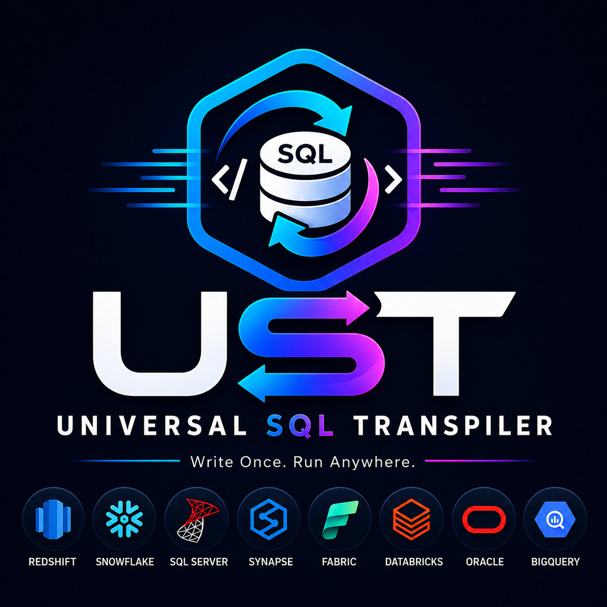
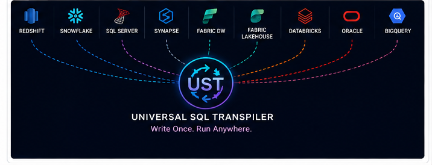
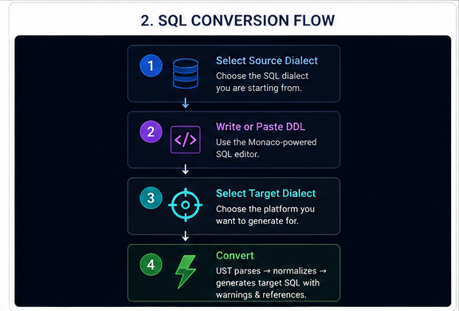
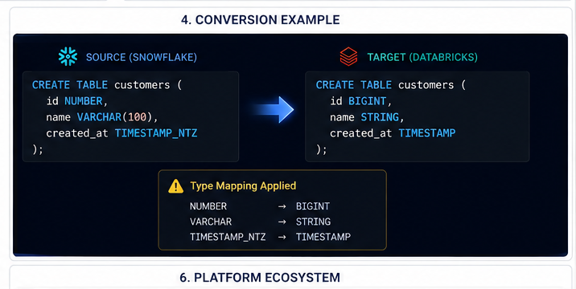
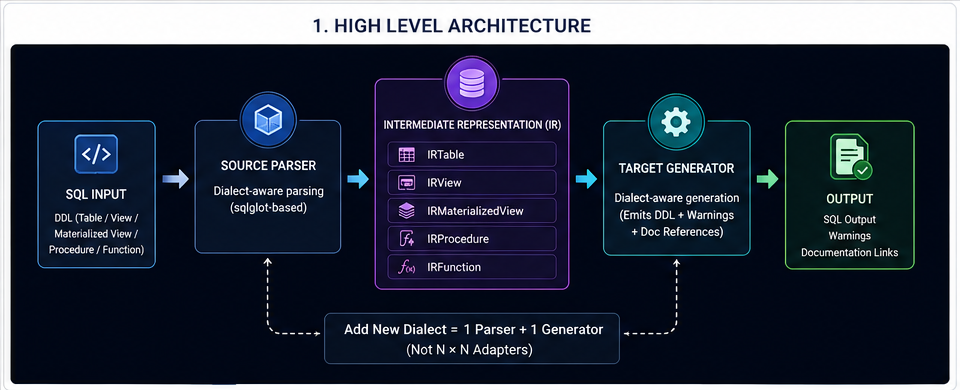
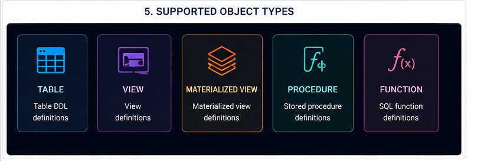
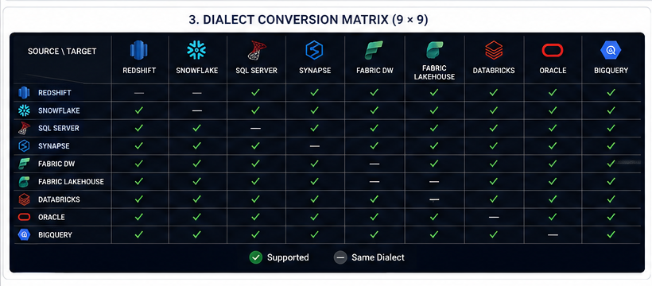

<p align="center">
  
</p>

<h1 align="center">Universal SQL Transpiler</h1>
<p align="center"><strong>Write Once. Run Anywhere.</strong></p>

<p align="center">
  Convert SQL DDL — tables, views, materialized views, stored procedures, and functions —
  between cloud and enterprise database platforms through one universal engine.
</p>

<p align="center">
  <a href="https://ust-frontend.onrender.com"><strong>Try UST →</strong></a>
  &nbsp;·&nbsp;
  <a href="https://ust-backend-mgt0.onrender.com/api/docs"><strong>API Docs →</strong></a>
  &nbsp;·&nbsp;
  <a href="https://github.com/Suryarathore2345/Universal-SQL-Transpiler"><strong>GitHub →</strong></a>
</p>

<p align="center">
  <sub>Both links run on Render's free tier — the backend sleeps after ~15 min idle, so the first request after a quiet period takes ~30–50s to cold-start.</sub>
</p>

<br/>

<table align="center">
  <tr>
    <td align="center"><h3>9</h3>Platforms</td>
    <td align="center"><h3>81</h3>Conversion Paths</td>
    <td align="center"><h3>5</h3>SQL Object Types</td>
    <td align="center"><h3>4,002</h3>Tests</td>
  </tr>
</table>

---

## Table of Contents

1. [Supported Platforms](#supported-platforms)
2. [Why UST?](#why-ust)
3. [How It Works](#how-it-works)
4. [Conversion Example](#conversion-example)
5. [Architecture](#architecture)
6. [Supported Objects](#supported-objects)
7. [Conversion Matrix](#conversion-matrix)
8. [Warnings & Conversion Intelligence](#warnings--conversion-intelligence)
9. [API Reference](#api-reference)
10. [Quick Start](#quick-start)
11. [Testing](#testing)
12. [Project Structure](#project-structure)
13. [Contributing / License](#contributing--license)

---

## Supported Platforms

<p align="center">
  
</p>

**Amazon Redshift · Snowflake · Microsoft SQL Server · Azure Synapse Analytics · Microsoft Fabric Data Warehouse · Microsoft Fabric Lakehouse · Databricks (Delta Lake) · Oracle Database · Google BigQuery**

---

## Why UST?

| | |
|---|---|
| **Universal IR** | An Intermediate Representation means adding a dialect requires 1 parser + 1 generator — not N × N adapters. |
| **81 Conversion Paths** | A 9 × 9 source-to-target dialect matrix — any supported platform to any other. |
| **5 SQL Object Types** | `TABLE`, `VIEW`, `MATERIALIZED VIEW`, `PROCEDURE`, `FUNCTION`. |
| **Conversion Warnings** | Every changed, dropped, unsupported, or fallback feature is flagged — not silently papered over. |
| **Documentation References** | Vendor documentation links are attached to relevant conversion differences. |
| **Extensive Testing** | 4,002 tests, including 322 golden snapshot files, run on every push. |

---

## How It Works

<p align="center">
  
</p>

Pick a source dialect, write or paste DDL into the Monaco-powered editor, pick a target dialect, and convert. UST parses the input, normalizes it into its intermediate representation, and generates target SQL along with any warnings and documentation references.

---

## Conversion Example

<p align="center">
  
</p>

---

## Architecture

```
SQL input → Source Parser → Intermediate Representation (IR) → Target Generator → SQL output + warnings + doc links
```

The IR layer is what keeps this tractable at 9 dialects: adding a new one requires **1 parser + 1 generator**, not N × N adapters.

<p align="center">
  
</p>

---

## Supported Objects

<p align="center">
  
</p>

### Object type support matrix

| Dialect | TABLE | VIEW | MAT. VIEW | PROCEDURE | FUNCTION |
|---|:---:|:---:|:---:|:---:|:---:|
| Redshift | ✅ | ✅ | ✅ | ✅ | ✅ |
| Snowflake | ✅ | ✅ | ✅ ¹ | ✅ | ✅ |
| SQL Server | ✅ | ✅ | ⚠️ ² | ✅ | ✅ |
| Synapse | ✅ | ✅ | ✅ | ✅ | ✅ |
| Fabric DW | ✅ | ✅ | ❌ ³ | ✅ | ✅ |
| Fabric Lakehouse | ✅ | ✅ | ✅ ⁵ | ❌ ⁶ | ✅ |
| Databricks | ✅ | ✅ | ✅ | ⚠️ ⁴ | ✅ |
| Oracle | ✅ | ✅ | ✅ | ✅ | ✅ |
| BigQuery | ✅ | ✅ | ✅ | ✅ | ✅ |

¹ Requires Enterprise Edition or higher.
² Converted to indexed view with `WITH SCHEMABINDING` — query may need adjustments.
³ Converted to a regular VIEW — no automatic refresh.
⁴ Converted to a SQL UDF stub — significant manual adaptation required.
⁵ Materialized Lake Views (MLV) require Fabric Runtime 1.3+.
⁶ No stored procedures on Spark SQL — converted to a SQL function stub; use a Fabric Notebook for real procedural logic.

---

## Conversion Matrix

UST supports 9 dialects, providing **81 possible source-to-target conversion paths**.

<p align="center">
  
</p>

---

## Warnings & Conversion Intelligence

UST does not pretend every conversion is identical — every changed, dropped, unsupported, or fallback feature surfaces as a warning with a severity level:

| Severity | Meaning |
|---|---|
| `INFO` | The conversion is complete and semantically equivalent; noted for awareness (e.g. a type mapping was applied). |
| `WARNING` | The output is usable but behaves differently, was approximated, or needs review before deploying. |
| `ERROR` | No safe automatic conversion exists — manual intervention is required. |

### Key per-target limitations

| Target | Limitation | Level |
|---|---|---|
| Snowflake | DISTKEY removed (managed automatically) | warn |
| Snowflake | Procedure bodies wrapped as-is — Snowflake Scripting differs | warn |
| SQL Server | MV → indexed view, SELECT must use two-part names | warn |
| Synapse | Every table needs explicit DISTRIBUTION | warn |
| Fabric DW | No materialized views | **error** |
| Databricks | No stored procedures → UDF stub | **error** |
| Databricks | CLUSTER BY and PARTITIONED BY are mutually exclusive | warn |
| Oracle | DATE type includes time component | info |
| BigQuery | No IDENTITY columns | warn |
| BigQuery | PK/FK are NOT ENFORCED | info |

Full limitations are returned by `GET /api/limitations` and shown in the UI's limitations panel.

---

## API Reference

The backend exposes endpoints under `/api`. Full interactive docs (request/response schemas, live "Try it out"): [ust-backend-mgt0.onrender.com/api/docs](https://ust-backend-mgt0.onrender.com/api/docs) (or `http://localhost:8000/api/docs` locally).

| Endpoint | Description |
|---|---|
| `POST /api/transpile` | Convert SQL from one dialect to another. Body: `sql`, `source_dialect`, `target_dialect`, optional `object_type` and `include_ir`. Returns converted SQL plus warnings, unsupported features, and doc references. |
| `GET /api/dialects` | List all supported dialects with display metadata. |
| `GET /api/limitations` | Known transpilation limitations for target dialects. Optional `?dialect=snowflake`. |
| `GET /api/health` | Liveness probe — `{ "status": "ok", "version": "1.0.0", "dialects_loaded": 9 }`. |

**Dialect keys**

| Key | Platform |
|---|---|
| `redshift` | Amazon Redshift |
| `snowflake` | Snowflake |
| `sqlserver` | Microsoft SQL Server |
| `synapse` | Azure Synapse Analytics |
| `fabric_dw` | Microsoft Fabric Data Warehouse |
| `fabric_lakehouse` | Microsoft Fabric Lakehouse |
| `databricks` | Databricks (Delta Lake) |
| `oracle` | Oracle Database |
| `bigquery` | Google BigQuery |

---

## Quick Start

### Prerequisites

| Tool | Minimum version | Notes |
|---|---|---|
| Python | 3.11 | 3.12 recommended |
| Node.js | 18 LTS | 20 LTS recommended |
| npm | 9+ | Bundled with Node.js |
| Docker + Compose | 24+ | Only needed for the Docker path |

### Docker (recommended)

No Python or Node.js required on the host.

```bash
cd universal-sql-transpiler
docker compose up --build
```

| URL | Service |
|---|---|
| http://localhost | Frontend UI |
| http://localhost:8000/api/docs | FastAPI interactive docs (Swagger) |
| http://localhost:8000/api/health | Health check |

To stop: `docker compose down`

### Local Development Setup

<details>
<summary><strong>Windows (PowerShell)</strong></summary>

Open PowerShell in the project root and run:

```powershell
.\setup.ps1
```

The script will:
1. Verify Python 3.11+ and Node.js 18+ are on `PATH`
2. Create `backend\.venv` and install all Python packages
3. Run `npm install` in `frontend/`
4. Run a smoke test to confirm the transpiler loads

After setup completes, start the two services in separate terminals:

**Terminal 1 — Backend**

```powershell
cd backend
.\.venv\Scripts\Activate.ps1
uvicorn app.main:app --reload
```

**Terminal 2 — Frontend**

```powershell
cd frontend
npm run dev
```

Open **http://localhost:5173** in your browser.

</details>

<details>
<summary><strong>Linux / macOS (bash)</strong></summary>

```bash
bash setup.sh
```

The script performs the same steps as the Windows version.

After setup, start both services:

**Terminal 1 — Backend**

```bash
cd backend
source .venv/bin/activate
uvicorn app.main:app --reload
```

**Terminal 2 — Frontend**

```bash
cd frontend
npm run dev
```

Open **http://localhost:5173** in your browser.

</details>

<details>
<summary><strong>Manual steps</strong></summary>

```bash
# 1. Backend virtual environment
cd universal-sql-transpiler/backend
python -m venv .venv

# Activate (Linux/macOS)
source .venv/bin/activate
# Activate (Windows PowerShell)
# .\.venv\Scripts\Activate.ps1

pip install --upgrade pip
pip install -r requirements.txt

# 2. Frontend dependencies
cd ../frontend
npm install
```

</details>

---

## Contributing / License

Contributions are welcome — see [CONTRIBUTING.md](CONTRIBUTING.md) for local setup, project conventions, and how to submit a change.

Licensed under the [MIT License](LICENSE).
